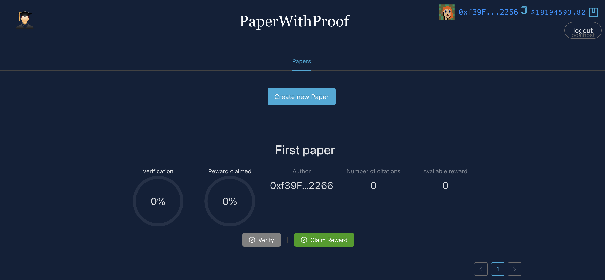

# PapersWithProof
PapersWithProof allow two things:
- for researchers to make value from their papers by the number of citations they have.
- Prove that the results listed on the papers are correct.


## Project's description
PapersWithProof is the [PapersWithCode](https://paperswithcode.com/) little brother.
PapersWithCode links the research papers to the code implementation in particular to improve the reproducibility of the lab experimentation. 

With PapersWithProof, we want to take a step further by guaranteeing that all the results listed in research papers are correct, i.e. have been computed honestly. We are therefore interested in the computational integrity of the researchers calculations to ensure reproducibility of the results but also their correctness.

Moreover, we have sometimes to pay to access research papers depending on the field. This is not an optimal way to value the work done. 
Instead, each paper is managed by our contract and the more you are cited, the more you can claim tokens. 
It is a way of rewarding papers which have an impact on the community. 

## How it works
There are one contract for the token serving as a reward. 
Another one to create papers and verify the proof on chain .
The last one is the verificator to check the validity of the proof and which is called by the PaperFactory from 2). 

Here we borrow the code to verify the circuits from [EZKL](https://github.com/zkonduit/ezkl.git)
It means that you can train the python model from [PyEZKL](https://github.com/zkonduit/pyezkl.git) and the code will be verified online.

## Overview
 

## Demo


## TODO 
This is a basic implementation because of the time constraints and there are a lot of changes to be made : 
- SBT instead of struct may be better.
- at the moment you can only cite one paper, by time constraints. We can add a list of citation at the paper creation. 
- instead of ERC20 tokens, we can think of governance tokens to reward the cited papers.
- Zero knowlege can eventually be added
## Directories


```bash
packages/vite-app-ts/
packages/hardhat-ts/
```

## Quick Start

### Commands to run the app

Running the app

1. install your dependencies, `open a new command prompt`

   ```bash
   yarn install
   ```

2. start a hardhat node

   ```bash
   yarn chain
   ```

3. run the app, `open a new command prompt`

   ```bash
   # build hardhat & external contracts types
   yarn contracts:build
   # deploy your hardhat contracts
   yarn deploy
   # start the app (vite)
   yarn start
   ```
   
4. test the contracts
   ```bash
   yarn test
   ```
   
5. other commands

   ```bash
   # rebuild all contracts, incase of inconsistent state
   yarn contracts:rebuild
   # run hardhat commands for the workspace, or see all tasks
   yarn hardhat 'xxx'
   # get eth for testing locally
   yarn hardhat faucet xxx
   # run any subgraph commands for the workspace
   yarn subgraph 'xxx'
   ```

   Other folders

   ```bash
   # for subgraph
   packages/advanced/subgraph/
   packages/advanced/services/
   ```

### Environment Variables

Vite  app folders has `.env` files. To create local variables that overrride these, create a file called `.env.local`, or `.env.development.local` or `.env.production.local` and put your overrides in there.

You can set your `TARGET_NETWORK` with them.


